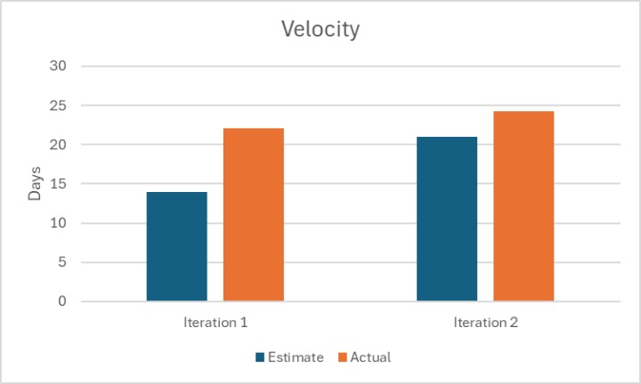

# Retrospective

## Discussion

Overall, Spenditure was successful. We had quite a lot of difficulties during the development process, but eventually, we overcame them and successfully delivered a project that we can be proud of. In terms of difficulty, there are some aspects that we could have improved to make our progress even smoother.

### Communication

Due to time constraints, it was impossible to ask everyone to stay online all the time to reply the messages and concerns from another group member. This is a bottleneck that affected our progress during development as there was latency between communication, which slowed down the development process. We realized this problem at the end of iteration 2, at the beginning of iteration 3, we decided to discuss further the requirement of each feature and dive deeper into the details of dev tasks and asked more questions to increase the understanding of each member about the part they are responsible for. Thanks to that, there were few questions and concerns during development and the progress went smoother. However, there were still some unavoidable issues that required communication among team members, but those were solved quickly and didn't affect the progress.

### Time Management

Time management and deadline scheduling were things that we didn't do well in iteration 2. In the meeting at the beginning of iteration 2, we discussed features, architecture, dev-tasks, etc..., but we didn't set a solid deadline for each task, which had a significant impact on development progress, since there were delays in some tasks, which cause delay independent tasks. Setting a solid deadline and encouraging everyone was our solution for iteration 3. And this solved almost the problem we had!

### Code Review

As discussed in the previous point, we had some problems with time management. This led to the fact that all the tasks were completed quite close to the due date, and we didn't have enough time to do a code review carefully. The improvement of the two problems mentioned helps us speed up development velocity and gives us reasonable time for code reviewing. Hope we can get a better mark for the last iteration!

### Success

How can we evaluate the success?

## Project Velocity

